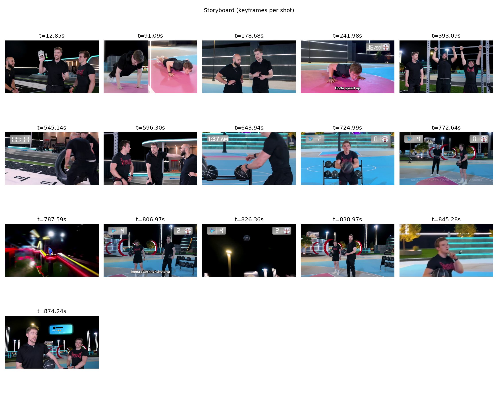
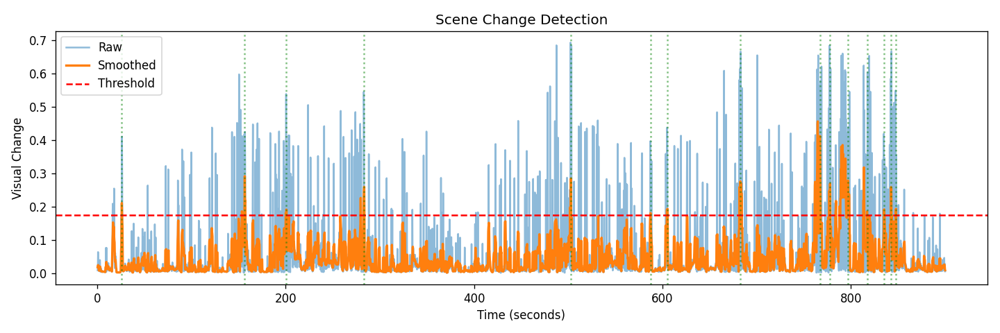

# 🎬 Automatic Video Summarization

**Transform long videos into concise, browsable summaries — perfect for YouTube Shorts!**

A production-ready tool that automatically detects scene changes, extracts representative keyframes, and generates condensed summary videos **with audio** — all controllable via CLI or a modern **Web UI**.

---

## 🎥 Demo Output

### Storyboard (Visual Overview)


### Scene Detection Analysis


### Summary Video
📹 **15 min video → 60 seconds with audio!** (93% compression, perfect for Shorts)

> **Quick start:** `python app.py` then open http://localhost:7860

---

## ✨ Features

| Feature | Description |
|---------|-------------|
| 🎯 **Scene Detection** | Visual change detection using color (HSV) and edge analysis |
| 🖼️ **Keyframe Extraction** | Automatically selects the most representative frame from each scene |
| 🔊 **Audio Preservation** | Summary video keeps original audio (requires ffmpeg) |
| ⏱️ **Duration Control** | Set maximum summary length (e.g., 60s for YouTube Shorts) |
| � **AI Transcription** | Whisper-powered speech recognition with auto scene titles |
| 📈 **Evaluation Metrics** | Academic-grade quality scores and analysis reports |
| �🌐 **Web UI** | Gradio-based interface — drag & drop, no CLI needed |
| 📊 **Structured Output** | JSON manifest with timestamps, durations, and quality scores |
| 🎥 **Summary Video** | Condensed MP4 preserving the essence of the original |
| 📋 **Storyboard** | Visual grid overview of all detected scenes |
| 🧹 **Input Cleaning** | Optional re-encoding to fix codec issues (H.264 mmco errors) |
| ⚡ **Quality Keyframes** | Optional sharpness-based keyframe selection |

---

## 🚀 Quick Start

### 1. Install Dependencies

```bash
pip install -r requirements.txt
```

**requirements.txt includes:**
- opencv-python
- numpy  
- matplotlib
- gradio (for Web UI)
- openai-whisper (for AI transcription)

### 2. Install ffmpeg (for audio support)

- **Windows**: `winget install --id Gyan.FFmpeg -e --source winget`
- **macOS**: `brew install ffmpeg`
- **Linux**: `sudo apt install ffmpeg`

### 3. Run the Tool

#### Option A: 🌐 Web UI (Recommended)
```bash
python app.py
```
Then open http://localhost:7860 in your browser — drag & drop your video!

#### Option B: 💻 Command Line
```bash
# Basic (with audio - now enabled by default!)
python summarize.py --input your_video.mp4 --output results/

# YouTube Shorts (60s max, optimized quality)
python summarize.py --input your_video.mp4 --output results/ \
    --max-duration 60 --best-keyframes

# Disable audio if needed
python summarize.py --input your_video.mp4 --output results/ --no-audio
```

---

## 🌐 Web UI

Launch the Gradio web interface for an easy-to-use, no-code experience:

```bash
python app.py
```

**Web UI Features:**
- 📁 Drag & drop video upload
- 🎚️ Adjustable parameters with sliders
- ⏱️ Max duration control (perfect for Shorts)
- 📥 Download summary video, storyboard, and manifest
- 🔄 Real-time processing feedback

---

## 📊 Example: YouTube Shorts Workflow

Create a **60-second Short** from a 15-minute video:

```bash
python summarize.py \
    --input data/demo.mp4 \
    --output outputs/shorts \
    --max-duration 60 \
    --threshold 90 \
    --secs-per-shot 2.5 \
    --best-keyframes
```

**Console Output:**
```
============================================================
   AUTOMATIC VIDEO SUMMARIZATION
   Transform long videos into concise summaries
============================================================

📹 Input: demo.mp4
   Duration: 00:15:00 (900.4s)
   Resolution: 1280x720 @ 30.0 fps

[1/5] Sampling frames...
   Sampled 3855 frames at 4.0 fps
[2/5] Extracting visual features...
[3/5] Computing frame distances...
[4/5] Detecting scene changes...
   Found 24 distinct scenes
[5/5] Generating outputs...
   Trimmed to 24 segments (60.0s) for max duration

============================================================
✅ SUMMARIZATION COMPLETE
============================================================
   Input:    00:15:00 (900.4s)
   Summary:  00:01:00 (60.0s)
   Compression: 93%
   Scenes:   24
```

---

## 📖 Command Line Options

| Option | Default | Description |
|--------|---------|-------------|
| `--input, -i` | required | Input video path |
| `--output, -o` | `outputs/summary` | Output directory |
| `--fps` | 4.0 | Analysis sampling rate |
| `--threshold` | 87 | Scene detection sensitivity (50-99, lower = more scenes) |
| `--min-duration` | 3.0 | Minimum scene duration (seconds) |
| `--secs-per-shot` | 2.5 | Seconds per scene in summary |
| `--max-duration` | 90.0 | **Maximum summary duration** (e.g., 60 for Shorts) |
| `--no-audio` | false | Disable audio (audio is **enabled by default**) |
| `--clean-input` | false | Re-encode input to fix codec issues |
| `--best-keyframes` | false | Pick sharpest keyframes instead of midpoint |
| `--transcribe` | false | **AI transcription** with Whisper (generates scene titles) |
| `--whisper-model` | base | Whisper model size: tiny, base, small, medium, large |

---

## 📄 Output Format

### summary.json
```json
{
  "generated_at": "2026-01-09T14:30:00",
  "input": {
    "path": "data/demo.mp4",
    "duration_sec": 900.4,
    "duration_hms": "00:15:00",
    "resolution": "1280x720",
    "fps": 30.0
  },
  "summary": {
    "path": "summary.mp4",
    "duration_sec": 64.0,
    "duration_hms": "00:01:04",
    "compression_percent": 93
  },
  "analysis": {
    "scenes_detected": 16,
    "threshold_used": 0.001234,
    "params": {
      "fps_sample": 4.0,
      "threshold_percentile": 97,
      "min_shot_duration": 5,
      "secs_per_shot": 3,
      "keep_audio": true
    }
  },
  "scenes": [
    {
      "index": 1,
      "start_sec": 0.0,
      "end_sec": 45.2,
      "start_hms": "00:00:00",
      "end_hms": "00:00:45",
      "duration_sec": 45.2,
      "keyframe": "keyframes/scene_01.jpg",
      "quality_score": 0.87
    }
  ]
}
```

---

## � AI Transcription (Whisper)

Generate automatic transcripts and scene titles from speech:

```bash
python summarize.py --input vlog.mp4 --output results/ \
    --transcribe --whisper-model base
```

**Output includes:**
- Full transcript in `summary.json`
- Auto-generated scene titles from speech content
- Language detection
- Word count and speech duration stats

**Whisper Model Sizes:**
| Model | Speed | Accuracy | VRAM |
|-------|-------|----------|------|
| tiny | Fastest | Good | ~1GB |
| base | Fast | Better | ~1GB |
| small | Medium | Good | ~2GB |
| medium | Slow | Great | ~5GB |
| large | Slowest | Best | ~10GB |

---

## 📈 Evaluation Metrics

Every summarization generates an `evaluation.txt` report:

```
============================================================
   VIDEO SUMMARIZATION EVALUATION REPORT
============================================================

📊 COMPRESSION METRICS
   Original Duration:  1238.37s
   Summary Duration:   30.26s
   Compression Ratio:  40.92:1
   Reduction:          97.6%

📍 COVERAGE METRICS
   Timeline Coverage:  100.0%
   Number of Scenes:   71
   Avg Scene Duration: 0.43s

📈 DISTRIBUTION ANALYSIS
   Uniformity Score:   0.451 (0-1, higher=better)
   Coverage Gaps:      0 bins
   Temporal Spread:    0.972

⭐ QUALITY METRICS
   Mean Quality:       0.508
   Quality Std Dev:    0.016
   Quality Range:      [0.5, 0.552]

🏆 OVERALL SCORE
   Score:              0.62 / 1.00
============================================================
```

---

## �🏗️ Architecture

```
Input Video
    │
    ▼
┌─────────────────┐
│ Frame Sampling  │  → Sample at N fps (default: 4)
└────────┬────────┘
         ▼
┌─────────────────┐
│ Feature Extract │  → HSV histogram + Edge histogram
└────────┬────────┘
         ▼
┌─────────────────┐
│ Distance Curve  │  → Chi-square distance between frames
└────────┬────────┘
         ▼
┌─────────────────┐
│ Shot Detection  │  → Smoothing + Threshold + NMS + Merging
└────────┬────────┘
         ▼
┌─────────────────┐
│ Output Gen      │  → Keyframes, Storyboard, Summary Video, JSON
└─────────────────┘
```

---

## 📁 Project Structure

```
automatic-video-summarization/
├── summarize.py           # 🎯 Main CLI entry point
├── app.py                 # 🌐 Gradio Web UI
├── requirements.txt       # Dependencies
├── README.md
├── LICENSE
├── data/
│   └── demo.mp4           # Sample input video
├── outputs/
│   └── result/            # Generated outputs
│       ├── summary.mp4
│       ├── summary.json
│       ├── evaluation.txt  # 📈 Quality metrics report
│       ├── storyboard.png
│       ├── analysis.png
│       └── keyframes/
├── scripts/
│   ├── inspect_video.py   # Video metadata inspector
│   └── run_demo.py        # Advanced demo script
└── src/
    ├── __init__.py
    ├── frame_sampling.py  # Video frame extraction
    ├── features.py        # Visual feature computation
    ├── distances.py       # Frame similarity metrics
    ├── shot_detection.py  # Scene boundary detection
    ├── keyframes.py       # Keyframe selection + highlight extraction
    ├── storyboard.py      # Storyboard generation
    ├── summary_video.py   # Video compilation (OpenCV)
    ├── av_concat.py       # Audio-preserving summary (ffmpeg)
    ├── preprocessing.py   # Video cleaning/re-encoding
    ├── transcription.py   # 🎤 Whisper AI transcription
    ├── evaluation.py      # 📈 Quality metrics & scoring
    ├── summary_manifest.py# JSON manifest generation
    └── io_outputs.py      # File I/O utilities
```

---

## 🎯 Use Cases & Recommended Settings

| Use Case | Command |
|----------|---------|
| **YouTube Shorts** | `--max-duration 60 --threshold 90 --secs-per-shot 2.5` |
| **Lectures** | `--threshold 92 --min-duration 10 --secs-per-shot 5` |
| **Meetings** | `--threshold 88 --min-duration 5 --secs-per-shot 3` |
| **Vlogs/YouTube** | `--threshold 85 --min-duration 2 --secs-per-shot 2` |
| **Surveillance** | `--threshold 95 --min-duration 30 --secs-per-shot 5` |
| **Quick Preview** | `--fps 2 --threshold 85 --secs-per-shot 1` |

---

## 🔮 Roadmap

- [x] **M0**: Core summarization pipeline
- [x] **M0**: Structured JSON output
- [x] **M1**: Audio preservation (ffmpeg integration)
- [x] **M1**: Quality-based keyframe selection
- [x] **M1**: Input video cleaning/re-encoding
- [x] **M2**: Web UI (Gradio)
- [x] **M2**: Max duration control (YouTube Shorts support)
- [x] **M3**: AI Transcription with Whisper
- [x] **M3**: Evaluation metrics & quality scoring
- [ ] **M4**: CLIP embeddings for semantic understanding
- [ ] **M4**: REST API

---

## 🛠️ Troubleshooting

| Issue | Solution |
|-------|----------|
| `ffmpeg not found` | Install ffmpeg and restart terminal (see below) |
| `H.264 mmco errors` | Use `--clean-input` to re-encode |
| Too many scenes | Increase `--threshold` (e.g., 92-95) |
| Too few scenes | Decrease `--threshold` (e.g., 80-85) |
| Summary too long | Use `--max-duration 60` or decrease `--secs-per-shot` |
| Blurry keyframes | Use `--best-keyframes` |
| No audio in output | Ensure ffmpeg is installed (audio is enabled by default) |
| Web UI permission errors | Restart terminal or use CLI instead |

### Windows: ffmpeg PATH Setup

If ffmpeg was installed via winget but isn't found:

```powershell
# Find and add ffmpeg to PATH permanently
$ffbin = (Get-ChildItem "$env:LOCALAPPDATA\Microsoft\WinGet\Packages" -Recurse -Filter "ffmpeg.exe" -ErrorAction SilentlyContinue | Select-Object -First 1).DirectoryName
if ($ffbin) {
    [Environment]::SetEnvironmentVariable("Path", "$ffbin;" + [Environment]::GetEnvironmentVariable("Path", "User"), "User")
    Write-Host "Added to PATH: $ffbin"
}
```

Then restart your terminal.

---

## 📄 License

MIT License - See [LICENSE](LICENSE) for details.

---

## 🤝 Contributing

Contributions welcome! Ideas for future improvements:
- [ ] CLIP embeddings for semantic scene understanding
- [ ] Face detection for people-focused summaries
- [ ] Speaker diarization (who said what)
- [ ] GPU acceleration with CUDA
- [ ] Batch processing multiple videos
- [ ] REST API for integration

---

**Made with ❤️ for content creators and AI researchers**
